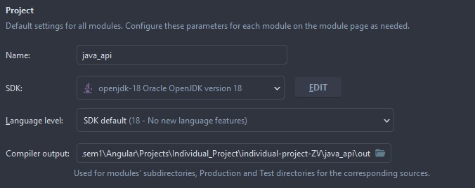
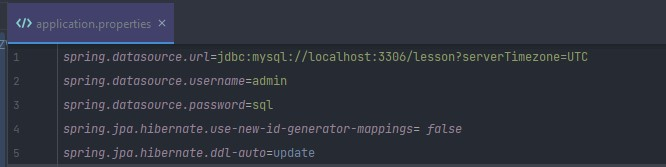

# Hoe de databank werkend krijgen
De gebruikte API is geschreven in Java, deze kan u terugvinden in de map "Java_api".
Mijn gebruikte IDE had volgende instellingen:

Als u de databank nog niet bestaat moet u in de file "application.properties" de update op lijn 5 aanpassen naar "create-drop", hierdoor gaat bij elke opstart hij de databank droppen en een nieuwe creëren. Zie afbeelding:

De username & password alsook url moet aangepast worden naargelang uw account.
- Java backend runt op poort 8080
- Angular frontend runt op poort 5878

# Hoe de Angular Applicatie werkend krijgen
1. Download en installeer NodeJs(https://nodejs.org/en/). Hiermee wordt automatisch ook npm client geïnstalleerd.
2. Dit kan u checken door in uw terminal "node -v" & "npm -v" te doen.
3. Vervolgens moet u in uw terminal " npm install -g @angular/cli@14.2.0 " uitvoeren. Dit om de Angular CLI te installeren.
4. Omdat de node_modules niet in de github repo staan kan het zijn dat u in uw terminal nog het commande "npm install" moet runnen.
5. Alles zou nu moeten werken. Voer in uw terminal "npm start" uit en de applicatie start op.

Dit is het Angular individueel project. Deadline hiervoor is **25 november**

# Movie Database #
Ik wil een Angular applicatie waar ik kan bijhouden welke films ik al gezien heb en welke films ik nog wil zien. Ik wil ook films die ik gezien heb een rating en opmerking kunnen geven.

# Vereiste functionaliteiten
* Ik wil een film kunnen zoeken via een open source movie API (bv die van IMDB, maar je mag gerust een andere 'gratis' API zoeken). Zoeken op naam is verplicht, extra zoekcriteria zijn optioneel
* Ik wil een gevonden film aan mijn ‘watchlist’ kunnen toevoegen
* Ik wil mijn ‘watchlist’ kunnen bekijken
* Ik wil films kunnen verwijderen van mijn ‘watchlist’
* Ik wil een film van mijn ‘watchlist’ kunnen aanduiden als bekeken + rating/opmerking geven
* Ik wil een aparte pagina waar ik al mijn bekeken films kan zien, filteren op naam/opmerking en sorteren op de gegeven rating
* Ik wil dat het geheel responsief is en er proper uitziet
* Ik wil minstens één extra module bovenop de AppModule
* We raden je aan om JSON Server als API te gebruiken, maar als je toch een ‘echte’ API wilt maken, dan mag dat (NodeJs, .NET, ...)
* Er moet niets van authenticatie/autorisatie geïmplementeerd worden
